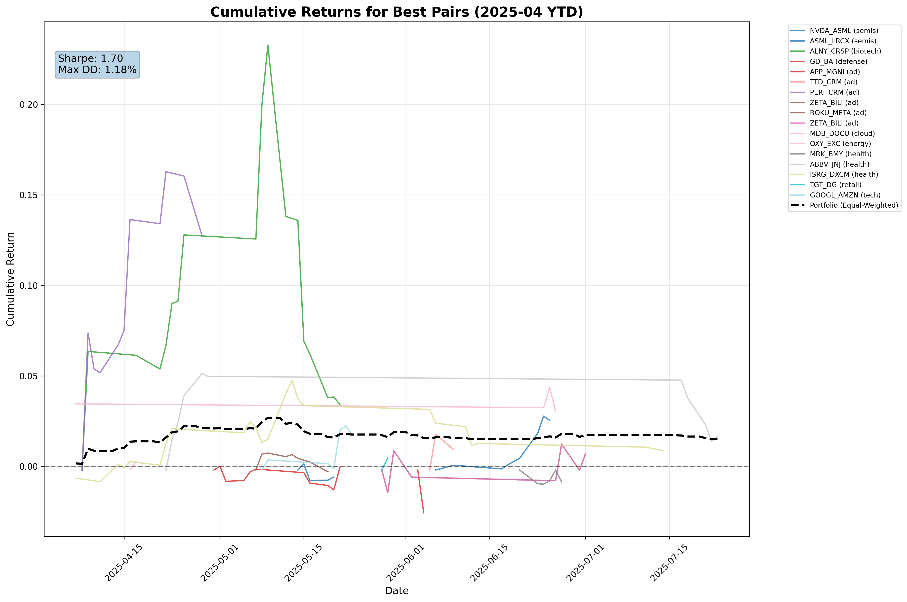

Final Return: 1.52%
P&L: $2,591.87

SUMMARY STATISTICS FOR BEST PAIRS (2025-04 YTD)
      Pair  Sector  Return %  Profit $  Max %  Min %  Max DD %
  PERI_CRM      ad     12.76   1276.05  16.28  -0.20      3.52
 ALNY_CRSP biotech      3.43    342.61  23.28  -0.20     19.85
   OXY_EXC  energy      3.04    303.87   4.36   3.04      1.32
 ASML_LRCX   semis      2.55    255.22   2.77  -0.20      0.22
GOOGL_AMZN    tech      1.80    179.59   2.24  -0.20      0.49
  ABBV_JNJ  health      1.62    162.10   5.12  -0.20      3.74
   TTD_CRM      ad      0.92     92.23   1.77  -0.20      0.85
 ISRG_DXCM  health      0.86     86.25   4.76  -0.85      3.90
 ZETA_BILI      ad      0.72     71.89   1.23  -1.45      1.66
 ZETA_BILI      ad      0.72     71.89   1.23  -1.45      1.66
    TGT_DG  retail      0.47     46.63   0.47  -0.20      0.00
  MDB_DOCU   cloud      0.27     26.59   0.27  -0.20      0.00
     GD_BA defense     -0.08     -7.84   0.01  -1.30      1.31
 ROKU_META      ad     -0.30    -29.61   0.74  -0.30      1.03
 NVDA_ASML   semis     -0.59    -58.53   0.14  -0.78      0.91
   MRK_BMY  health     -0.86    -85.78  -0.20  -0.98      0.78
  APP_MGNI      ad     -2.57   -256.52  -0.20  -2.57      2.37